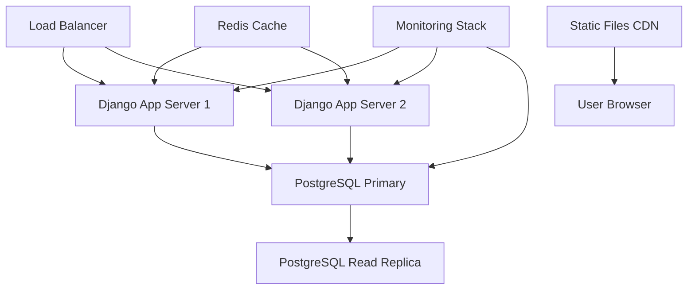

# SABC Production Readiness Roadmap

> **Project Goal**: Transform the South Austin Bass Club (SABC) Django application from a functional prototype into a production-grade, enterprise-ready system while maintaining compatibility with the existing live database.

## Current Status Assessment

**Overall Grade: C+ (Below Average)**
**Live Deployment**: ✅ Active on Digital Ocean Droplet
**Database**: PostgreSQL with existing tournament and user data
**Critical Constraint**: Must maintain database compatibility during upgrades

---

## 🎯 Production Readiness Goals

### **Phase 1: Critical Stability & Security (Weeks 1-2)**
**Priority: IMMEDIATE - Production Safety**

- [ ] **Database Migration Safety**
  - [ ] Create comprehensive database backup strategy
  - [ ] Implement zero-downtime migration process
  - [ ] Document current schema and data dependencies
  - [ ] Create rollback procedures for all changes

- [ ] **Security Hardening**
  - [ ] Fix authentication bypass vulnerabilities (`sabc/polls/views.py:73-74`)
  - [ ] Implement proper CSRF protection across all forms
  - [ ] Add input validation for all user-submitted data
  - [ ] Remove debug mode configuration issues (`sabc/settings.py:16`)
  - [ ] Fix email backend configuration inconsistency
  - [ ] Add rate limiting for form submissions

- [ ] **Critical Testing Coverage**
  - [ ] Implement view layer tests for authentication flows
  - [ ] Add integration tests for tournament creation/management
  - [ ] Test database migration scripts with production data copies
  - [ ] Create test data fixtures that mirror production scenarios

### **Phase 2: Performance & Reliability (Weeks 3-4)**
**Priority: HIGH - User Experience**

- [ ] **Database Optimization**
  - [ ] Identify and fix N+1 query patterns in views
  - [ ] Add `select_related` and `prefetch_related` optimizations
  - [ ] Implement database query analysis and monitoring
  - [ ] Create database indexes for frequently queried fields
  - [ ] Optimize tournament results calculation queries

- [ ] **Application Performance**
  - [ ] Refactor heavy template context preparation methods
  - [ ] Implement caching for tournament statistics and rankings
  - [ ] Add Redis/Memcached for session and query caching
  - [ ] Optimize image handling and static file delivery

- [ ] **Monitoring & Logging**
  - [ ] Implement comprehensive application logging
  - [ ] Add performance monitoring (response times, database queries)
  - [ ] Set up error tracking and alerting
  - [ ] Create health check endpoints

### **Phase 3: Code Quality & Maintainability (Weeks 5-6)**
**Priority: MEDIUM - Long-term Sustainability**

- [ ] **Architecture Refactoring**
  - [ ] Extract business logic from views to service classes
  - [ ] Implement proper separation of concerns
  - [ ] Create reusable components for tournament logic
  - [ ] Add comprehensive docstrings and code documentation

- [ ] **Testing Infrastructure**
  - [ ] Achieve 80%+ test coverage across all modules
  - [ ] Implement automated testing in CI/CD pipeline
  - [ ] Add end-to-end testing for critical user workflows
  - [ ] Create performance regression testing

- [ ] **Development Workflow**
  - [ ] Set up GitHub Actions for automated testing and deployment
  - [ ] Implement automated code quality checks
  - [ ] Create staging environment that mirrors production
  - [ ] Document deployment and rollback procedures

### **Phase 4: Advanced Features & Scalability (Weeks 7-8)**
**Priority: LOW - Future Growth**

- [ ] **API Development**
  - [ ] Implement Django REST Framework endpoints
  - [ ] Create mobile-friendly API for tournament data
  - [ ] Add API documentation with Swagger/OpenAPI
  - [ ] Implement API authentication and rate limiting

- [ ] **Enhanced User Experience**
  - [ ] Improve mobile responsiveness
  - [ ] Add real-time notifications for tournament updates
  - [ ] Implement advanced analytics and reporting
  - [ ] Create data export/import functionality

- [ ] **Infrastructure Improvements**
  - [ ] Implement horizontal scaling capabilities
  - [ ] Add load balancing support
  - [ ] Set up automated backups and disaster recovery
  - [ ] Create monitoring dashboards

---

## 🔍 Technical Findings Summary

### **Critical Issues Identified**

#### **Security Vulnerabilities**
```python
# CRITICAL: Authentication bypass in polls/views.py
try:
    if request.user.angler.member:  # Line 73-74
        # Logic here
except AttributeError:
    # This catches authentication failures silently!
    pass
```

#### **Performance Problems**
```python
# N+1 Query Pattern in users/views.py:119-141
def get_context_data(self, **kwargs):
    # Multiple separate database queries
    context["total_tournaments"] = Result.objects.filter(...)  # Query 1
    context["total_points"] = Result.objects.filter(...)       # Query 2  
    context["biggest_bass"] = Result.objects.filter(...)       # Query 3
    # Should be combined into single optimized query
```

#### **Database Configuration Issues**
```python
# Inconsistent database setup in settings.py
if os.environ.get("UNITTEST"):
    DATABASES = {"default": {"ENGINE": "django.db.backends.sqlite3"}}  # SQLite
else:
    DATABASES = {"default": {"ENGINE": "django.db.backends.postgresql_psycopg2"}}  # PostgreSQL
```

### **Testing Coverage Gaps**
- **View Layer**: 0% coverage - No tests for user authentication, form handling
- **Integration**: 0% coverage - No end-to-end workflow testing  
- **Business Logic**: ~30% coverage - Only basic tournament model tests exist
- **Security**: 0% coverage - No authentication/authorization testing

---

## 📊 Success Metrics

### **Phase 1 Success Criteria**
- [ ] Zero security vulnerabilities in security audit
- [ ] 100% successful migration testing with production data copy
- [ ] All critical user workflows covered by integration tests
- [ ] Zero-downtime deployment process documented and tested

### **Phase 2 Success Criteria**
- [ ] 90% reduction in database query count on tournament detail pages
- [ ] Page load times under 2 seconds for all user-facing pages
- [ ] Complete error tracking and monitoring implementation
- [ ] Automated performance regression detection

### **Phase 3 Success Criteria**
- [ ] 80%+ test coverage across all modules
- [ ] Automated CI/CD pipeline with zero manual deployment steps
- [ ] Code maintainability score improvement (measurable via code complexity metrics)
- [ ] Complete technical documentation for all systems

### **Phase 4 Success Criteria**
- [ ] RESTful API serving mobile and third-party integrations
- [ ] System capable of handling 10x current user load
- [ ] Complete disaster recovery procedures tested quarterly
- [ ] Advanced analytics providing actionable insights for club management

---

## 🛠️ Migration Strategy for Live Database

### **Safe Migration Approach**
1. **Pre-Migration Safety**
   ```bash
   # Create full database backup
   pg_dump sabc_production > backup_$(date +%Y%m%d_%H%M%S).sql
   
   # Test migration on copy
   createdb sabc_migration_test
   psql sabc_migration_test < backup_latest.sql
   python manage.py migrate --plan  # Review migration plan
   python manage.py migrate        # Test migration
   ```

2. **Blue-Green Deployment Pattern**
   - Deploy new version to parallel environment
   - Test with production data copy
   - Switch traffic only after validation
   - Keep old version running for immediate rollback

3. **Database Schema Evolution**
   - All schema changes must be backward compatible
   - Use Django's migration system with custom migration scripts
   - Implement gradual rollout for data transformations
   - Maintain audit trail of all schema changes

### **Risk Mitigation**
- **Rollback Plan**: Every deployment must have tested rollback procedure
- **Data Integrity**: Comprehensive data validation before and after migrations  
- **Downtime Window**: Plan for maximum 15-minute maintenance windows
- **Communication**: Notify users of planned maintenance 48 hours in advance

---

## 🚀 Deployment Architecture (Target)



### **Infrastructure Components**
- **Application Servers**: Multiple Django instances behind load balancer
- **Database**: PostgreSQL with read replicas for scaling
- **Caching**: Redis for session and query caching
- **Static Assets**: CDN for CSS, JS, images
- **Monitoring**: Comprehensive observability stack

---

## 📝 Development Standards (To Be Implemented)

### **Code Quality Standards**
- **Test Coverage**: Minimum 80% for all new code
- **Code Review**: All changes require peer review
- **Documentation**: All public APIs and complex business logic documented
- **Security**: Security review required for authentication/authorization changes

### **Development Workflow**
```bash
# Standard development cycle
git checkout -b feature/production-readiness-task
# Make changes
python manage.py test                    # All tests must pass
ruff check . && ruff format .           # Code formatting
pyright                                 # Type checking
coverage run --source='.' manage.py test # Coverage check
git commit -m "feat: implement production feature"
# Create pull request for review
```

---

## 🎯 Next Immediate Actions

1. **Create database backup and test environment** (This week)
2. **Fix critical security vulnerabilities** (This week) 
3. **Implement basic test coverage for authentication flows** (Next week)
4. **Set up monitoring for current production system** (Next week)

---

*Last Updated: August 7, 2025*
*Project Lead: Development Team*
*Stakeholders: South Austin Bass Club Members & Leadership*

> **Note**: This roadmap will be updated weekly as we progress through each phase. All changes to production systems must be approved and tested according to the migration strategy outlined above.